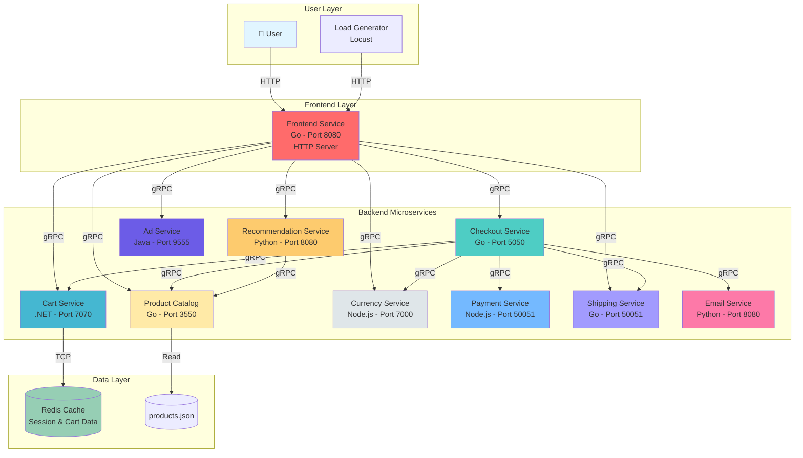

# 🛒 Microservices E-Commerce Platform on AWS EKS

[](https://www.terraform.io/)
[](https://kubernetes.io/)
[](https://aws.amazon.com/)
[](https://www.docker.com/)
[](https://argoproj.github.io/)
[](https://prometheus.io/)

> **A production-grade, cloud-native microservices e-commerce application deployed on AWS EKS with complete CI/CD automation, GitOps, and observability stack.**

## 📋 Table of Contents

- [Overview](#-overview)
- [Architecture](#-architecture)
- [Technology Stack](#-technology-stack)
- [Project Structure](#-project-structure)
- [Microservices](#-microservices)
- [Infrastructure](#-infrastructure)
- [CI/CD Pipeline](#-cicd-pipeline)
- [Deployment Strategy](#-deployment-strategy)
- [Monitoring & Observability](#-monitoring--observability)
- [Getting Started](#-getting-started)
- [Key Features](#-key-features)
- [Challenges & Solutions](#-challenges--solutions)
- [Future Enhancements](#-future-enhancements)
- [Contributing](#-contributing)

---

## 🎯 Overview

This project demonstrates a complete **DevOps implementation** of a microservices-based e-commerce platform running on **AWS Elastic Kubernetes Service (EKS)**. It showcases industry best practices for:

- **Infrastructure as Code (IaC)** using Terraform
- **Containerization** with multi-stage Docker builds
- **CI/CD Automation** with GitHub Actions
- **GitOps** deployment using ArgoCD
- **Observability** with Prometheus and Grafana
- **Service Mesh** architecture with gRPC communication
- **Cloud-native** patterns and practices

### What Makes This Project Unique?

✅ **11 Production-Ready Microservices** written in 4 different programming languages  
✅ **Automated Infrastructure Provisioning** using Terraform  
✅ **Path-Based CI/CD** - Only builds services that changed  
✅ **GitOps Workflow** with ArgoCD for declarative deployments  
✅ **Full Observability Stack** - Metrics, logs, and distributed tracing  
✅ **Zero-Downtime Deployments** with Kubernetes rolling updates  
✅ **Multi-Stage Docker Builds** reducing image sizes by 60-80%  

---

## 🏗️ Architecture

### Microservices Architecture Diagram



### CI/CD & Infrastructure Flow

```mermaid
graph LR
    subgraph "Development"
        Dev[👨‍💻 Developer]
        GitHub[GitHub Repository]
    end

    subgraph "CI/CD Pipeline"
        Actions[GitHub Actions]
        Build[Docker Build]
        ECR[AWS ECR<br/>Container Registry]
    end

    subgraph "GitOps"
        ArgoCD[ArgoCD<br/>GitOps Engine]
        K8sManifest[Kubernetes Manifests]
    end

    subgraph "AWS Cloud"
        subgraph "VPC"
            subgraph "EKS Cluster"
                Pods[Microservices Pods]
                Services[Kubernetes Services]
            end
            Jumphost[EC2 Jumphost]
        end
    end

    subgraph "Monitoring"
        Prometheus[Prometheus<br/>Metrics]
        Grafana[Grafana<br/>Dashboards]
    end

    Dev -->|Push Code| GitHub
    GitHub -->|Trigger| Actions
    Actions -->|Build & Test| Build
    Build -->|Push Image| ECR
    Actions -->|Update Manifest| K8sManifest
    K8sManifest -->|Detect Changes| ArgoCD
    ArgoCD -->|Deploy| Pods
    Pods -->|Expose| Services
    Pods -->|Scrape Metrics| Prometheus
    Prometheus -->|Visualize| Grafana
    Jumphost -->|Manage| EKS

    style Dev fill:#e1f5ff
    style GitHub fill:#24292e
    style Actions fill:#2088ff
    style ECR fill:#ff9900
    style ArgoCD fill:#ef7b4d
    style Pods fill:#326ce5
    style Prometheus fill:#e6522c
    style Grafana fill:#f46800
```



### Infrastructure Architecture

```mermaid
graph TB
    subgraph "Terraform IaC"
        TF[Terraform<br/>v1.8.4]
        S3[S3 Backend<br/>State Storage]
    end

    subgraph "AWS Region: us-east-1"
        subgraph "VPC 10.0.0.0/16"
            subgraph "Public Subnets"
                IGW[Internet Gateway]
                NAT[NAT Gateway]
                ALB[Application Load Balancer]
            end
            
            subgraph "Private Subnets"
                subgraph "EKS Cluster"
                    ControlPlane[EKS Control Plane<br/>Managed by AWS]
                    NodeGroup[Auto Scaling<br/>Worker Nodes]
                end
            end
            
            subgraph "Management Subnet"
                EC2Jump[EC2 Jumphost<br/>kubectl, helm, awscli]
            end
        end
    end

    subgraph "External Services"
        GitHub[GitHub Actions<br/>CI/CD]
        ECR[AWS ECR<br/>Container Registry]
    end

    TF -->|Provision| VPC
    TF -->|State| S3
    GitHub -->|Build & Push| ECR
    ECR -->|Pull Images| NodeGroup
    EC2Jump -->|Manage| ControlPlane
    IGW -->|Internet Access| ALB
    ALB -->|Route Traffic| NodeGroup
    NAT -->|Outbound Access| NodeGroup

    style TF fill:#623ce4
    style EKS fill:#ff9900
    style GitHub fill:#24292e
    style ECR fill:#ff9900
    style NodeGroup fill:#326ce5
```



---

## 🛠️ Technology Stack

### Programming Languages
| Service | Language | Framework | Version |
|---------|----------|-----------|---------|
| Frontend | Go | Gorilla Mux | 1.19+ |
| Cart Service | .NET | ASP.NET Core | 8.0 |
| Checkout Service | Go | gRPC | 1.21.3 |
| Product Catalog | Go | gRPC | 1.19+ |
| Shipping Service | Go | gRPC | 1.19+ |
| Currency Service | Node.js | Express | 20.8.0 |
| Payment Service | Node.js | gRPC | 20.8.0 |
| Email Service | Python | Flask/gRPC | 3.10.8 |
| Recommendation Service | Python | gRPC | 3.10.8 |
| Ad Service | Java | gRPC | 19 |
| Load Generator | Python | Locust | 3.11.1 |

### Infrastructure & DevOps
- **Container Orchestration**: Kubernetes (AWS EKS 1.28+)
- **Infrastructure as Code**: Terraform 1.8.4
- **CI/CD**: GitHub Actions
- **GitOps**: ArgoCD
- **Container Registry**: AWS ECR
- **Service Discovery**: Kubernetes DNS
- **Monitoring**: Prometheus + Grafana (kube-prometheus-stack)
- **Caching**: Redis
- **Load Testing**: Locust

### AWS Services
- **EKS** - Managed Kubernetes
- **EC2** - Jumphost for cluster management
- **ECR** - Container image registry
- **VPC** - Network isolation
- **IAM** - Security and access control
- **S3** - Terraform state backend
- **ALB/NLB** - Load balancing

---

## 📁 Project Structure

```
microservices-ecommerce-eks-project/
├── .github/
│   └── workflows/              # CI/CD pipeline definitions
│       ├── ec2.yml            # EC2 jumphost provisioning
│       ├── eks.yml            # EKS cluster provisioning
│       ├── cartservice.yml    # Cart service build & deploy
│       ├── frontend.yml       # Frontend service build & deploy
│       └── ...                # Other microservices workflows
├── infra/
│   ├── ec2/                   # Terraform for jumphost
│   │   ├── main.tf
│   │   ├── variables.tf
│   │   └── outputs.tf
│   ├── eks/                   # Terraform for EKS cluster
│   │   ├── main.tf
│   │   ├── variables.tf
│   │   └── outputs.tf
│   └── backend-s3/            # S3 backend for Terraform state
├── src/
│   ├── adservice/             # Ad recommendations (Java)
│   ├── cartservice/           # Shopping cart (.NET)
│   ├── checkoutservice/       # Order processing (Go)
│   ├── currencyservice/       # Currency conversion (Node.js)
│   ├── emailservice/          # Order confirmations (Python)
│   ├── frontend/              # Web UI (Go)
│   ├── loadgenerator/         # Load testing (Locust)
│   ├── paymentservice/        # Payment processing (Node.js)
│   ├── productcatalogservice/ # Product inventory (Go)
│   ├── recommendationservice/ # ML recommendations (Python)
│   └── shippingservice/       # Shipping quotes (Go)
├── deployments/               # Kubernetes manifests
│   ├── adservice.yml
│   ├── cartservice.yml
│   ├── redis-cart.yml
│   └── ...
├── argo-cd/                   # ArgoCD setup documentation
│   └── README.md
├── monitoring/                # Prometheus/Grafana setup
│   └── README.md
└── docs/
    └── images/                # Architecture diagrams
```

---

## 🚀 Microservices

### Service Details

| Service | Port | Description | Technology | Dependencies |
|---------|------|-------------|------------|--------------|
| **Frontend** | 8080 | Web UI and user-facing application | Go, Gorilla Mux | All backend services |
| **Cart Service** | 7070 | Manages shopping cart state | .NET 8.0, Redis | Redis |
| **Checkout Service** | 5050 | Orchestrates order processing | Go, gRPC | Cart, Currency, Email, Payment, Product, Shipping |
| **Product Catalog** | 3550 | Product inventory management | Go, gRPC | products.json |
| **Currency Service** | 7000 | Multi-currency conversion | Node.js, gRPC | Static exchange rates |
| **Payment Service** | 50051 | Credit card payment processing | Node.js, gRPC | - |
| **Email Service** | 8080 | Order confirmation emails | Python, Jinja2 | - |
| **Shipping Service** | 50051 | Shipping quotes and tracking | Go, gRPC | - |
| **Recommendation Service** | 8080 | Product recommendations | Python, gRPC | Product Catalog |
| **Ad Service** | 9555 | Contextual advertisements | Java 19, gRPC | - |
| **Load Generator** | N/A | Simulates user traffic | Python, Locust | Frontend |

### Service Communication

- **Protocol**: gRPC (HTTP/2) for backend services, HTTP for frontend
- **Service Discovery**: Kubernetes DNS
- **Load Balancing**: Kubernetes Service (ClusterIP/LoadBalancer)
- **Health Checks**: gRPC health checking protocol
- **Tracing**: OpenTelemetry distributed tracing

---

## 🏢 Infrastructure

### Infrastructure Components

#### 1. **EC2 Jumphost**
- **Purpose**: Secure bastion host for EKS cluster management
- **Provisioning**: Terraform
- **Configuration**: kubectl, AWS CLI, Helm pre-installed
- **Workflow**: `.github/workflows/ec2.yml`

#### 2. **EKS Cluster**
- **Kubernetes Version**: 1.28+
- **Node Groups**: Auto-scaling worker nodes
- **Networking**: AWS VPC with public/private subnets
- **Add-ons**: CoreDNS, kube-proxy, AWS VPC CNI
- **Workflow**: `.github/workflows/eks.yml`

#### 3. **Terraform State Management**
- **Backend**: AWS S3
- **State Locking**: DynamoDB
- **Versioning**: Enabled
- **Encryption**: At rest and in transit

### Network Architecture

```
VPC (10.0.0.0/16)
├── Public Subnets (NAT Gateway, Load Balancers)
├── Private Subnets (EKS Worker Nodes)
└── Internet Gateway
```

---

## ⚙️ CI/CD Pipeline

### Pipeline Architecture

```
Code Push → GitHub Actions → Build & Test → Docker Build → ECR Push → Update K8s Manifest → ArgoCD Sync → EKS Deployment
```

### Workflow Details

#### **Path-Based Triggering**
Each microservice has its own CI/CD pipeline that triggers only when relevant code changes:

```yaml
on:
  push:
    branches: [main]
    paths:
      - 'src/cartservice/**'
      - 'deployments/cartservice.yml'
```

#### **Pipeline Stages**

1. **Code Checkout** - Fetches latest code
2. **AWS Authentication** - Configures AWS credentials
3. **ECR Login** - Authenticates with container registry
4. **Docker Build** - Multi-stage build for optimization
5. **Image Tagging** - Tags with build number and latest
6. **ECR Push** - Pushes to AWS ECR
7. **Manifest Update** - Updates Kubernetes deployment with new image
8. **Git Commit** - Commits manifest changes (triggers ArgoCD)

#### **Example Workflow** (CartService)

```yaml
name: CartService CI/CD

on:
  push:
    paths:
      - 'src/cartservice/**'

env:
  ECR_REGISTRY: 947985349339.dkr.ecr.us-east-1.amazonaws.com
  ECR_REPOSITORY: cartservice

jobs:
  build-and-deploy:
    runs-on: ubuntu-latest
    steps:
      - name: Build Docker Image
      - name: Push to ECR
      - name: Update Kubernetes Manifest
      - name: Commit Changes (triggers ArgoCD)
```

### Image Tagging Strategy

- **Build Number**: `<service>:${{ github.run_number }}`
- **Latest**: `<service>:latest`
- **Traceability**: Build number links to GitHub Actions run

---

## 📦 Deployment Strategy

### GitOps with ArgoCD

#### **Why ArgoCD?**
- ✅ Declarative GitOps continuous delivery
- ✅ Automated sync with Git repository
- ✅ Rollback capabilities
- ✅ Multi-cluster support
- ✅ Health status monitoring

#### **Deployment Flow**

```
1. Developer pushes code to main branch
2. GitHub Actions builds and pushes Docker image
3. GitHub Actions updates deployments/*.yml with new image tag
4. GitHub Actions commits manifest changes to repo
5. ArgoCD detects changes in Git
6. ArgoCD syncs changes to EKS cluster
7. Kubernetes performs rolling update
8. Zero-downtime deployment complete
```

#### **ArgoCD Configuration**

- **Sync Policy**: Automatic or Manual
- **Self-Heal**: Automatically corrects drift
- **Prune**: Removes resources deleted from Git
- **Health Assessment**: Monitors deployment health

### Kubernetes Deployment Strategy

- **Strategy**: RollingUpdate
- **Max Unavailable**: 25%
- **Max Surge**: 25%
- **Readiness Probes**: gRPC health checks
- **Liveness Probes**: Service health endpoints

---

## 📊 Monitoring & Observability

### Prometheus + Grafana Stack

#### **Metrics Collection**
- **Prometheus**: Scrapes metrics from all services
- **Node Exporter**: Hardware and OS metrics
- **Kube State Metrics**: Kubernetes object metrics
- **Service Metrics**: Custom application metrics

#### **Visualization**
- **Grafana Dashboards**: 
  - Kubernetes cluster overview
  - Node resource utilization
  - Pod metrics and health
  - Service-specific dashboards
  - Custom business metrics

#### **Alerting**
- **Alertmanager**: Routes alerts to Slack, email, PagerDuty
- **Alert Rules**: CPU, memory, disk, pod health
- **Notification Channels**: Configurable integrations

### Distributed Tracing

- **OpenTelemetry**: Instrumentation for all services
- **Google Cloud Profiler**: Performance profiling
- **Structured Logging**: JSON logs with correlation IDs

### Observability Features

```
┌─────────────────────────────────────────────┐
│          Monitoring Stack                   │
├─────────────────────────────────────────────┤
│  Prometheus  →  Metrics Collection          │
│  Grafana     →  Visualization               │
│  Alertmanager → Alert Routing               │
│  OpenTelemetry → Distributed Tracing        │
│  Logrus/Pino  → Structured Logging          │
└─────────────────────────────────────────────┘
```

---

## 🚦 Getting Started

### Prerequisites

- AWS Account with appropriate permissions
- GitHub account with repository access
- `kubectl` CLI tool
- `terraform` CLI (1.8.4+)
- `helm` CLI (3.x)
- `aws` CLI configured

### Step-by-Step Deployment

#### **Phase 1: Infrastructure Setup**

1. **Configure GitHub Secrets**
   ```bash
   AWS_ACCESS_KEY_ID
   AWS_SECRET_ACCESS_KEY
   ```

2. **Configure GitHub Variables**
   ```bash
   AWS_REGION (e.g., us-east-1)
   GIT_EMAIL
   GIT_USERNAME
   ```

3. **Provision S3 Backend** (One-time setup)
   ```bash
   cd infra/backend-s3
   terraform init
   terraform apply
   ```

4. **Deploy EC2 Jumphost**
   - Navigate to Actions → "Step 1 - Deploy EC2 Infrastructure"
   - Select workflow → Run workflow → Choose "apply"

5. **Deploy EKS Cluster**
   - Navigate to Actions → "Step 2 - Provision EKS Infrastructure"
   - Select workflow → Run workflow → Choose "apply"

#### **Phase 2: Cluster Configuration**

6. **Configure kubectl** (from jumphost)
   ```bash
   aws eks update-kubeconfig --region us-east-1 --name <cluster-name>
   ```

7. **Install ArgoCD**
   ```bash
   # Follow instructions in argo-cd/README.md
   kubectl create namespace argocd
   kubectl apply -n argocd -f https://raw.githubusercontent.com/argoproj/argo-cd/stable/manifests/install.yaml
   ```

8. **Install Monitoring Stack**
   ```bash
   # Follow instructions in monitoring/README.md
   kubectl create namespace monitoring
   helm install kube-prom-stack prometheus-community/kube-prometheus-stack -n monitoring
   ```

#### **Phase 3: Application Deployment**

9. **Deploy Redis**
   ```bash
   kubectl apply -f deployments/redis-cart.yml
   ```

10. **Deploy Microservices**
    - Make a code change to any service (or trigger workflow manually)
    - CI/CD pipeline automatically builds and deploys
    - ArgoCD syncs changes to cluster

11. **Verify Deployment**
    ```bash
    kubectl get pods -n dev
    kubectl get svc -n dev
    ```

12. **Access Application**
    ```bash
    kubectl get svc frontend -n dev
    # Use EXTERNAL-IP to access application
    ```

---

## ✨ Key Features

### 1. **Multi-Language Microservices**
- Demonstrates polyglot architecture
- Best tool for each job
- Language-specific optimizations

### 2. **Production-Grade CI/CD**
- Automated testing and deployment
- Path-based triggering (efficiency)
- Rollback capabilities
- Build number traceability

### 3. **Infrastructure as Code**
- Reproducible environments
- Version-controlled infrastructure
- Easy disaster recovery

### 4. **GitOps Deployment**
- Single source of truth (Git)
- Audit trail of all changes
- Automated reconciliation

### 5. **Cloud-Native Patterns**
- 12-Factor App principles
- Stateless services
- External configuration
- Health checks and graceful shutdown

### 6. **Observability**
- Full-stack monitoring
- Distributed tracing
- Centralized logging
- Real-time alerting

### 7. **Security Best Practices**
- Multi-stage Docker builds (reduced attack surface)
- Non-root containers
- Resource limits and quotas
- Network policies
- Secrets management

### 8. **High Availability**
- Multi-AZ deployment
- Auto-scaling worker nodes
- Rolling updates (zero downtime)
- Health checks and self-healing

---

## 📚 Documentation

Each microservice has detailed documentation:

- [Ad Service](src/adservice/README.md)
- [Cart Service](src/cartservice/README.md)
- [Checkout Service](src/checkoutservice/README.md)
- [Currency Service](src/currencyservice/README.md)
- [Email Service](src/emailservice/README.md)
- [Frontend](src/frontend/README.md)
- [Load Generator](src/loadgenerator/README.md)
- [Payment Service](src/paymentservice/README.md)
- [Product Catalog](src/productcatalogservice/README.md)
- [Recommendation Service](src/recommendationservice/README.md)
- [Shipping Service](src/shippingservice/README.md)

Additional documentation:
- [ArgoCD Setup](argo-cd/README.md)
- [Monitoring Setup](monitoring/README.md)

---

## 🎓 Skills Demonstrated

This project showcases proficiency in:

### DevOps & Cloud
- ✅ AWS (EKS, EC2, ECR, VPC, IAM, S3)
- ✅ Terraform (Infrastructure as Code)
- ✅ Kubernetes (Orchestration, Deployments, Services)
- ✅ Docker (Multi-stage builds, containerization)
- ✅ CI/CD (GitHub Actions, automated pipelines)
- ✅ GitOps (ArgoCD, declarative deployments)

### Monitoring & Observability
- ✅ Prometheus (Metrics collection)
- ✅ Grafana (Dashboards, visualization)
- ✅ OpenTelemetry (Distributed tracing)
- ✅ Structured Logging (JSON logs)

### Programming & Architecture
- ✅ Microservices Architecture
- ✅ gRPC (High-performance RPC)
- ✅ RESTful APIs
- ✅ Multi-language development (Go, .NET, Node.js, Python, Java)
- ✅ Service mesh patterns
- ✅ Caching strategies (Redis)

### Best Practices
- ✅ 12-Factor App methodology
- ✅ Infrastructure as Code
- ✅ GitOps workflows
- ✅ Security best practices
- ✅ High availability design
- ✅ Automated testing and deployment

---

## 🤝 Contributing

Contributions are welcome! Please follow these steps:

1. Fork the repository
2. Create a feature branch (`git checkout -b feature/amazing-feature`)
3. Commit your changes (`git commit -m 'Add amazing feature'`)
4. Push to the branch (`git push origin feature/amazing-feature`)
5. Open a Pull Request

### Development Guidelines

- Follow language-specific style guides
- Add tests for new features
- Update documentation
- Ensure CI/CD pipeline passes
- Keep Docker images optimized

---

## 📝 License

This project is licensed under the Apache License 2.0 - see individual service files for details.

---

## 👤 Author

**Gilbert Daniel**

- GitHub: [@GilbertDaniel](https://github.com/GilbertDaniel)
- LinkedIn: [Add your LinkedIn]
- Portfolio: [Add your portfolio]

---

## 🙏 Acknowledgments

- Based on Google Cloud's microservices demo architecture
- Kubernetes and CNCF community for excellent tooling
- AWS for robust cloud infrastructure
- Open-source contributors of all dependencies

---

## 📊 Project Statistics

- **Total Microservices**: 11
- **Programming Languages**: 4 (Go, .NET, Node.js, Python, Java)
- **Infrastructure Components**: 3 (EC2, EKS, ECR)
- **CI/CD Workflows**: 13
- **Kubernetes Manifests**: 12
- **Lines of Documentation**: 5000+

---

## 🔗 Quick Links

- [View Architecture Diagram](#-architecture)
- [Infrastructure Setup](#-infrastructure)
- [Deployment Guide](#-getting-started)
- [Monitoring Setup](monitoring/README.md)
- [ArgoCD Setup](argo-cd/README.md)

---

<div align="center">

### ⭐ If you found this project helpful, please give it a star!

**Built with ❤️ for learning and demonstrating DevOps best practices**

</div>
